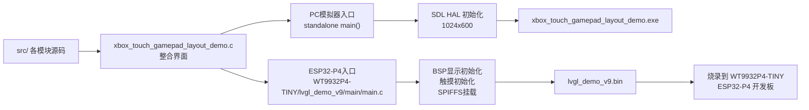

# 项目架构流程图

## 总体架构

```mermaid
flowchart TD
    A["E:\\Vscode_codes\\lvgl"] --> B["src/ 自定义源码层"]
    A --> C["lv_port_pc_vscode-master/ PC模拟器工程"]
    A --> D["WT9932P4-TINY/ ESP32-P4硬件工程"]
    A --> E[".bat/ Windows辅助脚本"]
    A --> F["configs/ PC端布局配置"]
    A --> G["AGENTS.md / 项目说明"]

    B --> B1["joystick_stick_demo.c<br/>左摇杆模块"]
    B --> B2["Dpad.c<br/>十字键模块"]
    B --> B3["shoulder_keys_demo.c<br/>L1/L2/R1/R2模块"]
    B --> B4["codex_gpt5_slider_2d_demo.c<br/>二维视角滑块模块"]
    B --> B5["gamepad_button_module.c<br/>单按键模块"]
    B --> B6["gamepad_module_builders.h<br/>模块公共创建接口"]
    B --> B7["gamepad_layout_model.h/.c<br/>布局模型、默认坐标、合法性校验、存档"]
    B --> B8["xbox_touch_gamepad_layout_demo.c<br/>整合界面主文件"]

    B1 --> B8
    B2 --> B8
    B3 --> B8
    B4 --> B8
    B5 --> B8
    B6 --> B8
    B7 --> B8

    C --> C1["CMakeLists.txt<br/>定义 xbox_touch_gamepad_layout_demo 目标"]
    C --> C2["bin/xbox_touch_gamepad_layout_demo.exe<br/>PC运行产物"]
    C1 --> B
    B8 --> C2

    D --> D1["lvgl_demo_v9/main/main.c<br/>ESP32-P4启动入口"]
    D --> D2["lvgl_demo_v9/main/CMakeLists.txt<br/>把 src/ 模块编进硬件工程"]
    D --> D3["lvgl_demo_v9/managed_components/<br/>LVGL/BSP/板级依赖"]
    D --> D4["common_components/<br/>硬件公共组件"]
    D --> D5["build/lvgl_demo_v9.bin<br/>MCU固件产物"]

    D1 --> B8
    D2 --> B
    D3 --> D1
    D4 --> D1
    B8 --> D5

    E --> E1["build_and_run_xbox_touch_gamepad_layout_demo.bat<br/>PC一键编译运行"]

    H["E:\\Vscode_codes\\gamepad\\test_1\\mcu_flash_package_20260705"] --> H1["firmware/<br/>bootloader.bin<br/>partition-table.bin<br/>lvgl_demo_v9.bin"]
    H --> H2["project_source/<br/>源码快照"]
    H --> H3["flash_firmware.bat<br/>直接烧录"]
    H --> H4["build_and_flash_from_source.bat<br/>源码编译再烧录"]
    H --> H5["README_烧录说明.md"]
    H --> H6["开发交接说明.md"]
```

## 运行路径

## 你最常改的文件

- 整合界面主逻辑：`E:\Vscode_codes\lvgl\src\xbox_touch_gamepad_layout_demo.c`
- 默认布局与坐标：`E:\Vscode_codes\lvgl\src\gamepad_layout_model.h`
- 布局存档与合法性校验：`E:\Vscode_codes\lvgl\src\gamepad_layout_model.c`
- 左摇杆模块：`E:\Vscode_codes\lvgl\src\joystick_stick_demo.c`
- 十字键模块：`E:\Vscode_codes\lvgl\src\Dpad.c`
- 肩键模块：`E:\Vscode_codes\lvgl\src\shoulder_keys_demo.c`
- 二维视角滑块：`E:\Vscode_codes\lvgl\src\codex_gpt5_slider_2d_demo.c`
- 单按键模块：`E:\Vscode_codes\lvgl\src\gamepad_button_module.c`
- ESP32-P4 硬件入口：`E:\Vscode_codes\lvgl\WT9932P4-TINY\lvgl_demo_v9\main\main.c`
- ESP32-P4 构建入口：`E:\Vscode_codes\lvgl\WT9932P4-TINY\lvgl_demo_v9\main\CMakeLists.txt`

## 一句话理解

- `src/` 负责功能模块和整合界面。
- `lv_port_pc_vscode-master/` 负责 PC 模拟器运行。
- `WT9932P4-TINY/` 负责 ESP32-P4 硬件运行。
- `mcu_flash_package_20260705/` 是最终交付给别人烧录的成品包。
